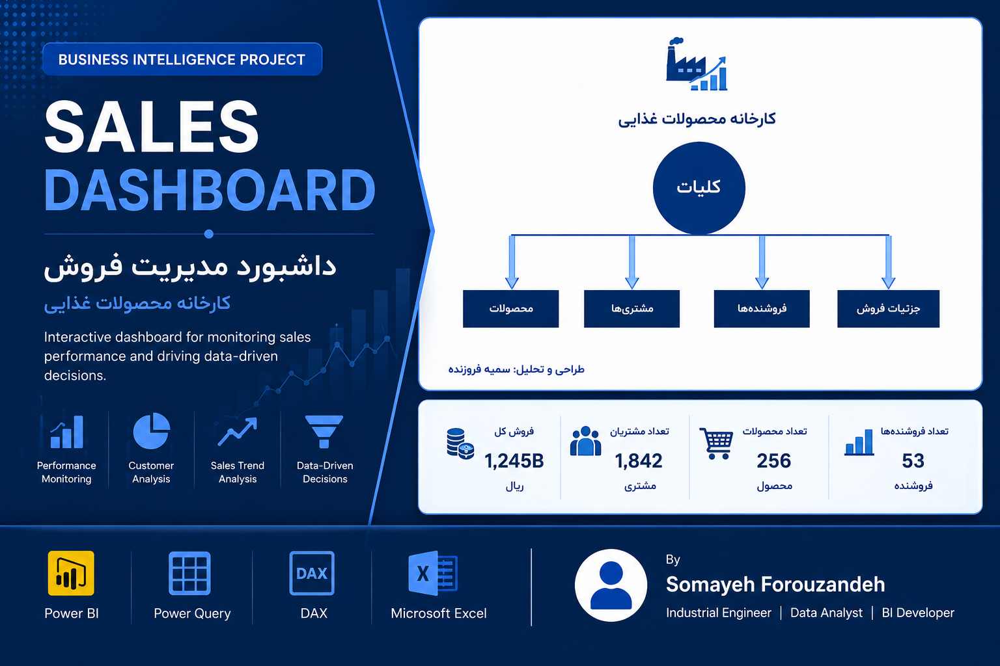

<p align="center">
  
</p>

# 📊 Sales Dashboard using Power BI

<p align="center">


</p>

---

# 📖 Overview

This project presents an interactive Sales Dashboard developed using **Microsoft Power BI** for a food manufacturing company.

The dashboard enables managers to monitor sales performance through interactive reports, KPIs, product analysis, customer analysis, salesperson performance, and detailed sales transactions.

---

# 🎯 Business Objectives

- Monitor overall sales performance
- Analyze products
- Analyze customers
- Evaluate salesperson performance
- Track sales trends
- Review detailed sales transactions
- Support management decision-making

---

# 🛠 Technologies Used

- Microsoft Power BI
- Power Query
- DAX
- Microsoft Excel

---

# 📷 Dashboard Pages

## 🏠 Home

Main navigation page.


---

## 📈 Executive Overview

Executive sales overview and KPIs.


---

## 📦 Products

Product performance analysis.


---

## 👥 Customers

Customer purchasing analysis.


---

## 👨‍💼 Salespersons

Salesperson performance evaluation.


---

## 📋 Sales Details

Detailed sales transaction report.


---

# 📊 Key Performance Indicators

- Total Sales
- Sales Quantity
- Sales Weight
- Customer Count
- Product Performance
- Salesperson Performance
- Sales Trends

---

# 💼 Skills Demonstrated

- Business Intelligence
- Dashboard Design
- Data Visualization
- Data Modeling
- Power Query
- DAX
- KPI Design
- Interactive Reporting

---

# 📁 Repository Structure

```text
PowerBI-Sales-Dashboard
│
├── README.md
├── SALE-Somayeh Forouzandeh.pbix
│
├── Assets
│   └── Banner.png
│
└── Screenshots
    ├── Home.png
    ├── Overview.png
    ├── Products.png
    ├── Customers.png
    ├── Salespersons.png
    └── SalesDetails.png
```

---

# 🚀 Future Improvements

- Profit Analysis
- Sales Forecasting
- Geographic Analysis
- Customer Segmentation
- Inventory Dashboard

---

# 👩‍💻 Author

## Somayeh Forouzandeh

Industrial Engineer

Data Analyst

Business Intelligence Developer

⭐ If you like this project, don't forget to give it a Star!
