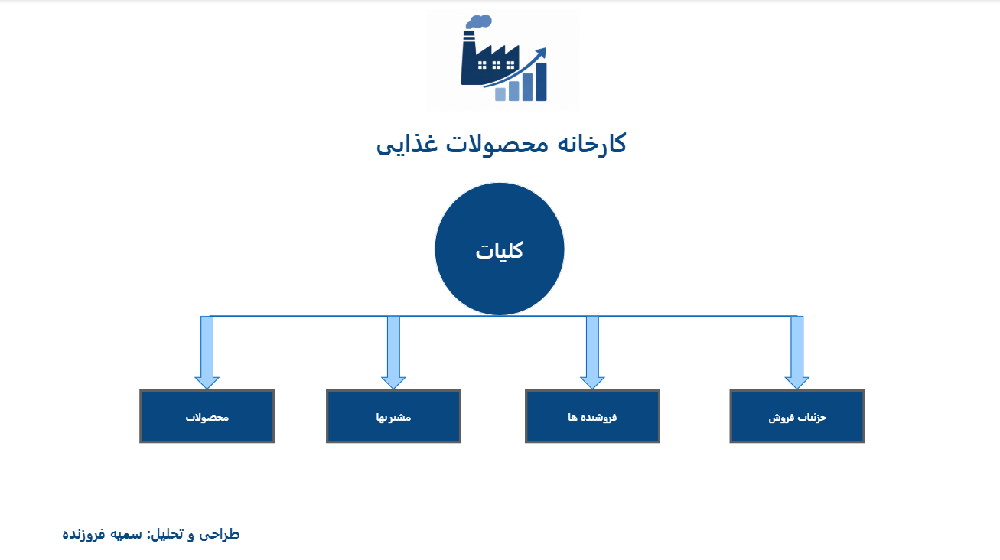
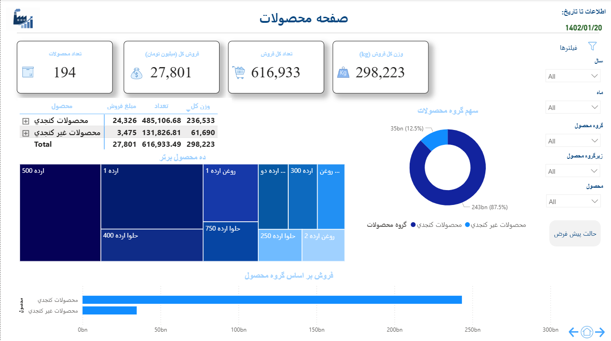
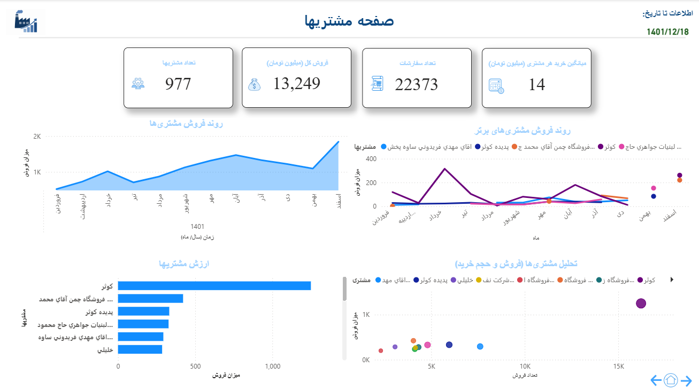
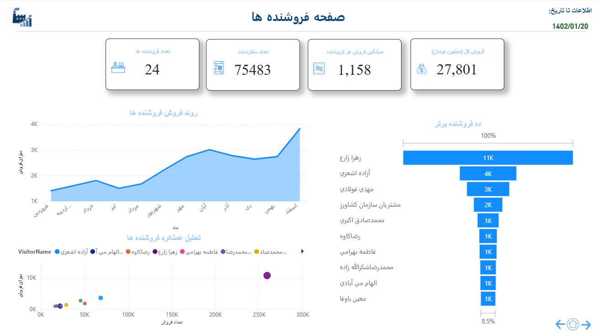
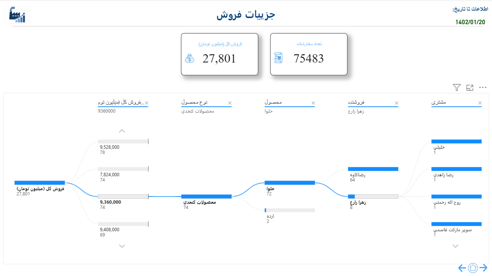

# 📊 Sales Dashboard using Power BI

---

## 📖 Overview

Interactive Sales Dashboard developed using Microsoft Power BI.

---

## 🖼 Dashboard Preview

### 🏠 Home

---

### 📈 Overview

---

### 📦 Products

---

### 👥 Customers

---

### 👨‍💼 Salespersons

---

### 📋 Sales Details

---

## 🛠 Tools

- Microsoft Power BI
- Power Query
- DAX
- Microsoft Excel

---

## 👩‍💻 Author

**Somayeh Forouzandeh**

Industrial Engineer | Data Analyst | Business Intelligence Developer
